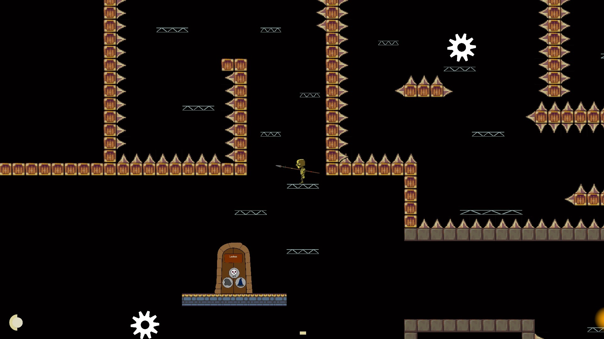

Clone is a 2D platformer made in Unity. 
- 
I developed weapon system and UI for this game.

- 
Team: 
Yunxiao Cai (Gameplay, UI) 
Christian Boyd (Gameplay, Enemy AI, Player Movement) 
Dong Wang (Gameplay, Enemy AI) 
Liam Scott (Level Design) 
Tanner McDougal (2D Art) 
