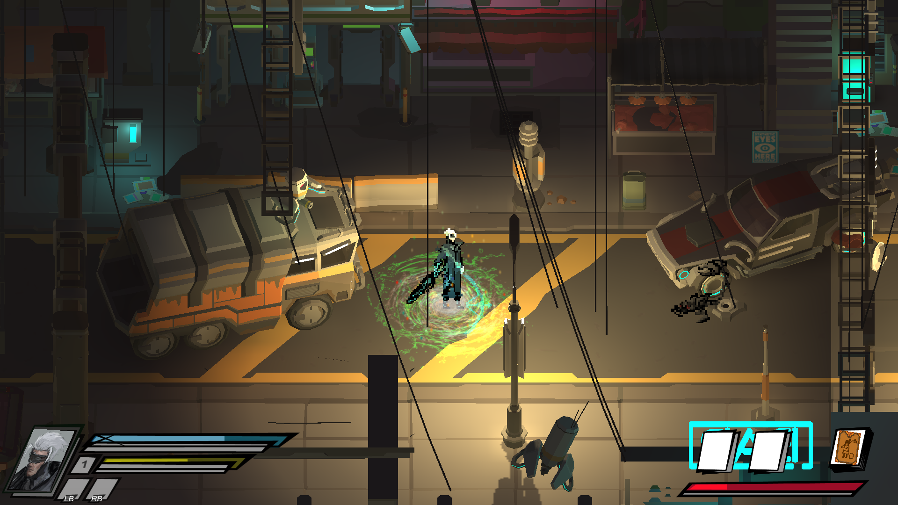
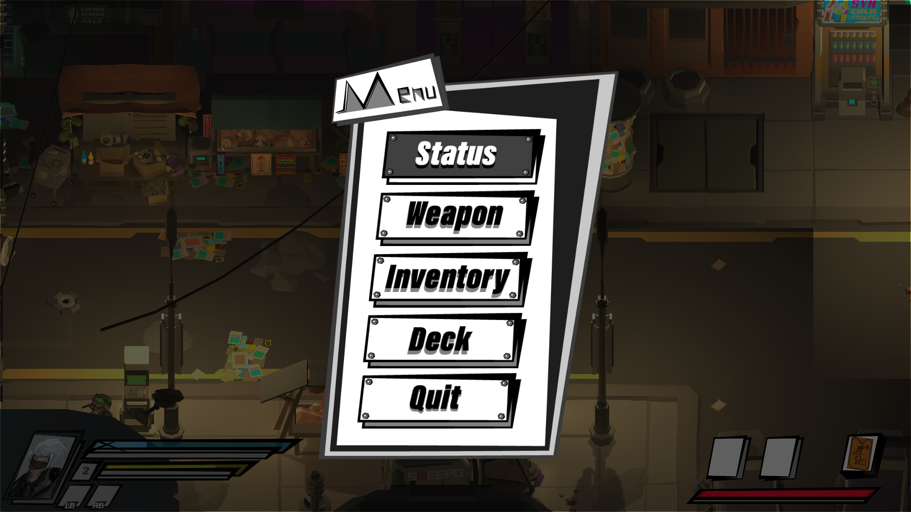
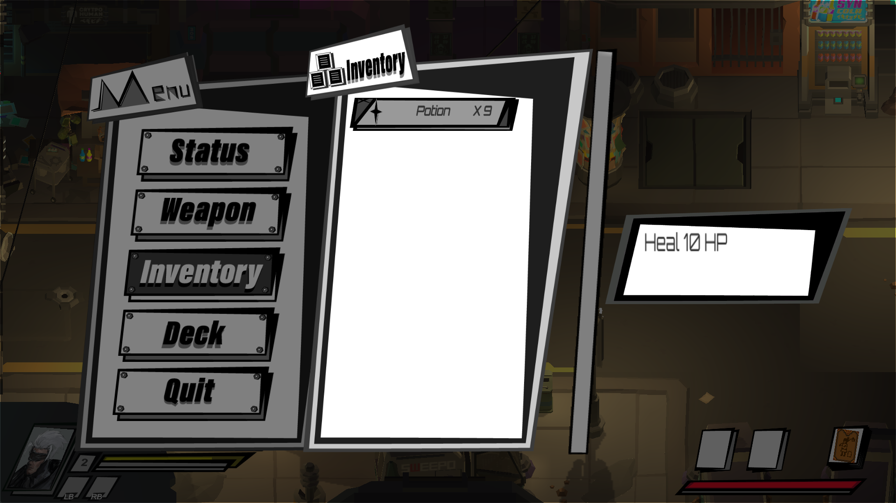
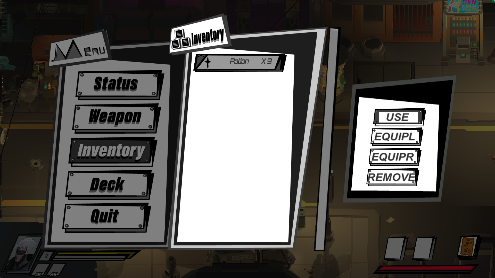

Lontarot is a 2.5D platformer made in Unity. 
I did visual effect, inventory system, UI programming and story writing for this game. 
- 
A particle effect created by me for an ability of the main character. 

- 
The menu directly inherit from my MenuLayer script. 

Link to my MenuLayer Code Sample 
https://github.com/Lutetium0/LontarotUICodeSample/blob/master/MenuLayer.cs 
- 
The inventory inherit from my VerticalScrollMenuLayer script. 
 
Link to my VerticalScrollMenuLayer Script Code Sample 
https://github.com/Lutetium0/LontarotUICodeSample/blob/master/VerticalScrollMenuLayer.cs 
- 
The inventory menu is changing its display when players click confirm button. 
 
Link to my Inventory Script Script Code Sample 
https://github.com/Lutetium0/LontarotUICodeSample/blob/master/InventoryDisplay.cs 
- 
Team: 
Yunxiao Cai (Inventory System, UI Programming, Visual Effect, Story Writing) 
Dong Wang (AI, Player Movement, Game Structure Construction) 
Chong Duan (Concept Art, Pixel Art Animation) 
Jinrui Hu (UI Design) 
