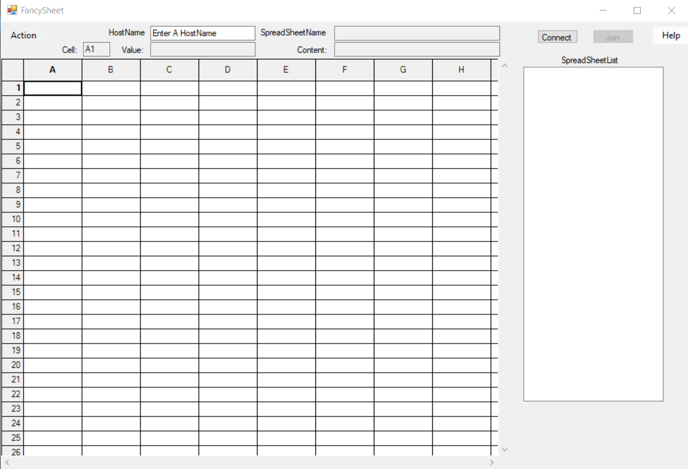

MultiUserSpreadsheet is a project developed in Windows Forms(Client) and Linux(Server) which allows multiple users to connect to
the same spreadsheet and edit cells in spreadsheet simultaneously. 
- 
A screenshot of the client developed by me in Windows Forms. 
 
Link to my code sample for this client 
https://github.com/Lutetium0/MultiUserSpreadsheetClientSample/blob/master/Form1.cs 
- 
Team: 
Yunxiao Cai(Client, Network) 
Dong Wang(Server, Network) 
Rong Xiao(Server, Network) 
