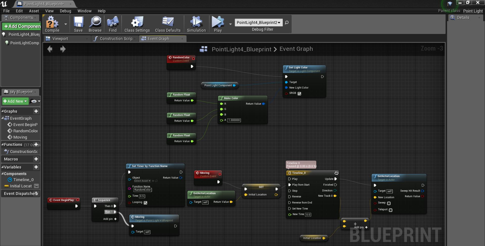

The Pill is an 3D animation made in Unreal Engine 4. 
- 
I developed the lighting effect from 2:53 to 3:06 with Unreal Blueprint. 
I also made the animation sequence from 3:07 to 3:21. 
<iframe width="1120" height="630" src="https://www.youtube.com/embed/WVfgGY-7nik" frameborder="0" allow="accelerometer; autoplay; encrypted-media; gyroscope; picture-in-picture" allowfullscreen></iframe>
A screenshot of my blueprint for that light effect.

- 
Team: 
Yunxiao Cai (Lighting, Material, Animation) 
Bryce Woodell (Cinematography, Editing) 
Jess Ulloa (Cinematography, Sound, Music, Environment) 
Austin Gibbons (Animation, Cinematography, Editing) 
Butros Ajami (Environment, Editing, Story elements) 
Isaac Smith (Cinematography, Editing, Texturing, Animation) 
Dassan Verstrepen (Cinematography, Editing) 
Scott Foden (Editing, Cinematography, Animation) 
Wess Lancaster (Music, Animation, Produce) 
Jack McCarthy 
